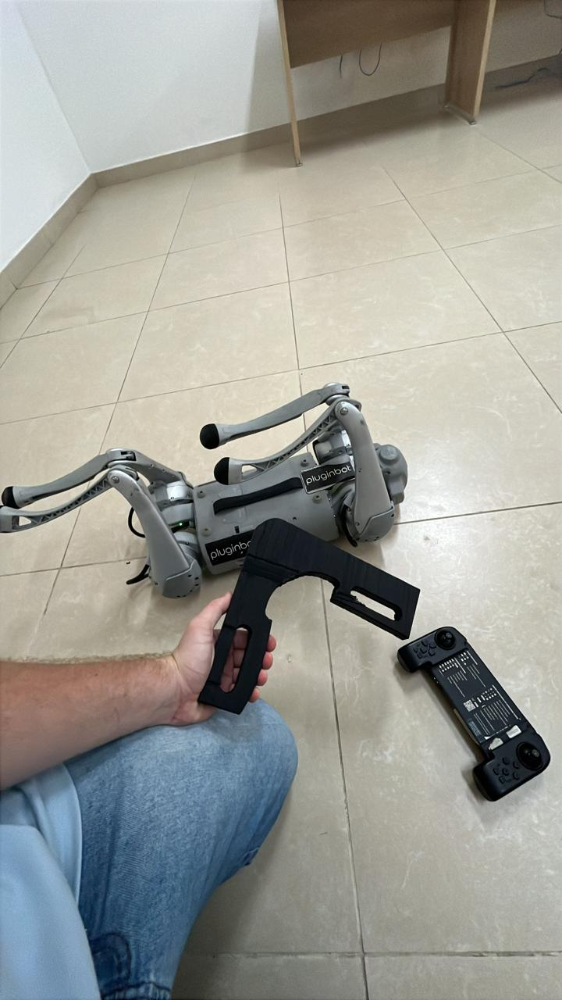
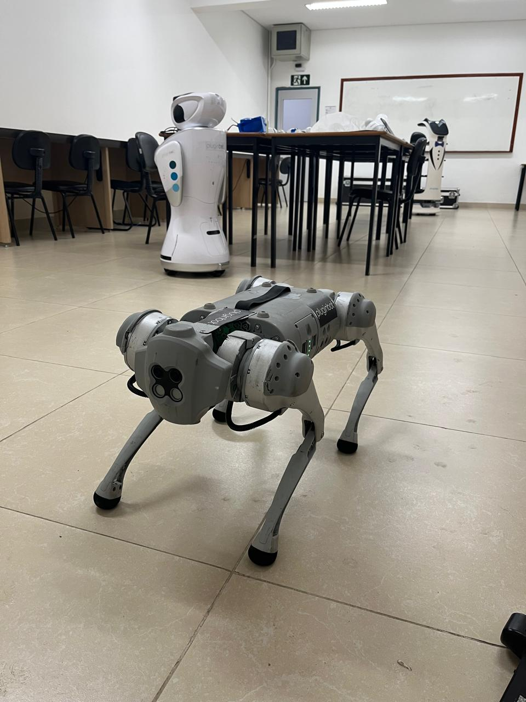
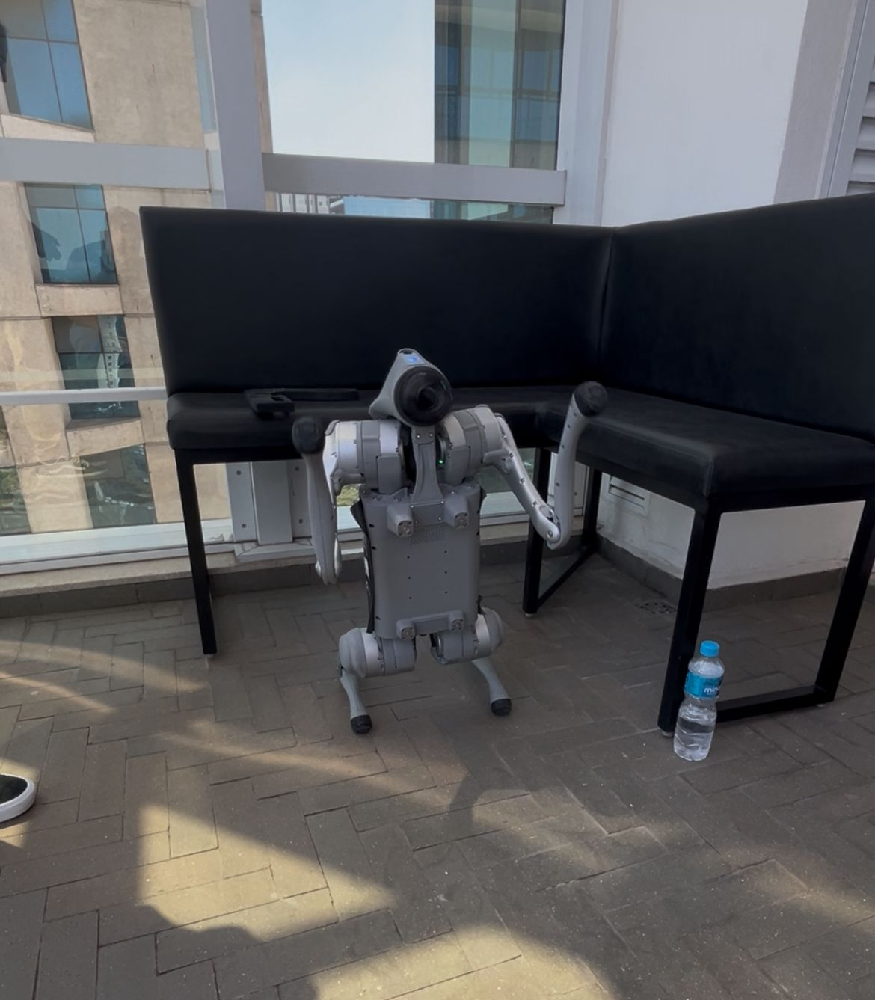

# Unitree Go1 & Go2 Calibration Rig & Procedure

## Introduction
This repository provides comprehensive tools and guides for calibrating the joint zero positions of **Unitree Go1** and **Unitree Go2** quadruped robots. Accurate calibration is critical for optimal walking stability, posture correction, and complex athletic maneuvers. Included are models for a 3D-printable L-shaped calibration rig and detailed step-by-step software procedures.

---

## Calibration Tools & Material Selection

The central alignment tool is the L-shaped calibration rig, precisely designed to lock each of the 12 joint motors into a perfect 90-degree reference angle. 

> [!WARNING]
> **Material Selection Matters:** Unlike gear manufacturing, **Resin (SLA/DLP) is NOT recommended** for this calibration rig. Resin can be overly brittle and prone to micro-chipping at the indexing edges. Furthermore, its surface friction characteristics can cause slipping or binding against the robot's composite leg segments, potentially introducing minor offsets that compromise precise zeroing.

### Recommended Printing Specs:
* **Manufacturing Process:** **FDM (Fused Deposition Modeling)** is highly preferred here.
* **Primary Materials:** **ABS** or **ASA** are strongly recommended due to their excellent dimensional stability, slight natural structural compliance, and low-wear surface friction properties. **PETG** or premium **PLA** can serve as alternatives if enclosed printing is unavailable.
* **Print Settings:** Use a low layer height (0.15mm - 0.2mm), a minimum of 4 walls/perimeters, and at least 35% gyroid infill to eliminate any flex within the tool body.

---

## Image Reference

Below is the L-shaped calibration tool being used on a Unitree Go1. The black L-shape rig is held firmly by a technician to align the knee joint while the robot is placed in its low-power calibration stance.

*(Note: Visual markers on the robot chassis have been masked with black structural overlays for clean repository documentation).*

---

## Calibration Rig Usage

1. **Power down** the robot completely or put the joints into a zero-torque/damping state.
2. Apply the L-shaped rig directly to the joint slated for calibration. Ensure both internal structural faces of the L-rig sit completely flush against the adjacent leg segments, mechanically locking the joint at exactly 90 degrees.
3. Hold the rig perfectly steady and flush while executing the hardware calibration routines detailed below.

---

## Calibration Procedures

### 1. Unitree Go1 (via Remote Control)
The Go1 utilizes its physical remote controller to cycle through and overwrite joint encoders manually.

1. Power on the robot and place it into its relaxed calibration position. 
2. Firmly apply the 3D-printed ABS rig to the target joint.
3. **Enter Calibration Mode:** Press and hold **`L1 + R1 + F2`** simultaneously on the remote.
4. **Select Motor:** Use the **`L1`** and **`R1`** buttons to cycle through the 12 individual motors (Knee, Hip, and Abduction joints across Front-Left, Front-Right, Rear-Left, Rear-Right).
5. **Fine-Tune:** Carefully nudge the left and right joysticks to adjust the motor's encoder offsets until the leg segments conform perfectly to your calibration rig.
6. **Confirm & Save:** Press the **`Start`** button to commit the new zero position for that specific joint.
7. Repeat this exact tracking sequence for all remaining joints.
8. **Full Stance Recalibration:** Once all individual joints are locked in, command the robot into a standard standing posture on a flat surface, then press **`L1 + Start`** to save the global default stance.

### 2. Unitree Go2 (via Mobile App)
The Go2 moves away from remote shortcuts, management being handled entirely within the graphical user interface of the official Unitree mobile application.

1. Boot the robot up on a level surface and open the **Unitree App** on your mobile device/tablet, establishing a reliable connection to your Go2.
2. Maneuver the robot down into its designated calibration position and firmly seat the L-rig on the target joint.
3. In the application interface, navigate to: **Settings > Calibration**.
4. Follow the interactive wizard sequence displayed on-screen. The system will prompt you to confirm the physical perpendicular alignment of each leg assembly before overwriting the internal flash memory.
5. The application will run a self-check and display a visual confirmation upon successful sensor calibration.

---

## Testing Calibration

Once your joint offsets are updated, use these direct commands to put the quadruped through high-stress poses to verify structural balance and eliminate drifting.

### Unitree Go1 Testing (Remote Control)
* **Stand-up Posture Check:** Rapidly push the left joystick forward **twice**. The Go1 will immediately transition into a full-height standing stance. Inspect all 4 legs visually to ensure symmetric load distribution and parallel alignment.
* **Dynamic Stress Test:** Trigger complex athletic sequences, such as the pre-programmed 'backflip' sequence (rapidly pushing the left joystick backward **twice**), evaluating whether the robot lands flush without pulling to one side.

### Unitree Go2 Testing (App / Remote Control)
* **Stand-Up Deployment:** Select the **'Stand Up'** module directly within the application workspace (or tap the left joystick forward twice on the physical controller) to observe the initial extension.
* **Postural Stability Overrides:** Open the app's pose manipulation panel. Drag the pitch, roll, and yaw sliders to force the Go2 into extreme angles. A properly calibrated unit will fluidly shift its center of mass and recover stable equilibrium without trembling or buckling at the knees.

---

## Repository Structure
* `/models`: Contains the `.STL` and `.STEP` source files for the L-shaped calibration rig.
* `/images`: Calibration stance diagrams, remote mapping layouts, and assembly graphics.

## License
This documentation and the accompanying hardware files are open-source and licensed under the MIT License.
